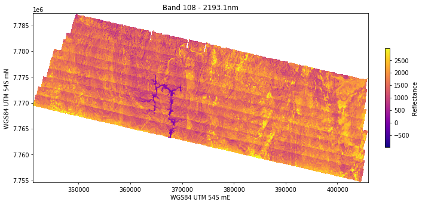
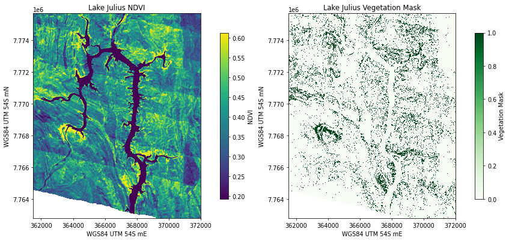
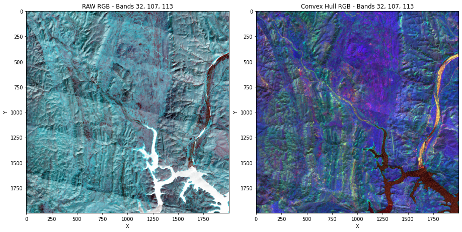
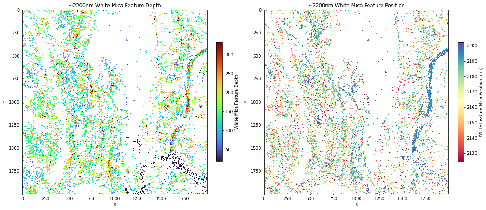

# Queensland HyMap Data Sets

This repository is complimentary to a Datarock applied science [blogpost](link_to_blogpost) that seeks to demonstrate some fully open source methods for processing, manipulating and analysing hyperspectral data sets with relatively modest computing resources. 

## Notebooks

###  [**01_apply_geocorrections_and_mosaic.ipynb**](notebooks/01_apply_geocorrections_and_mosaic.ipynb)

This notebok was used to apply geometry lookup tables to raw reflectance data cubes in order to generate a georeferenced hyperspectral mosaic in ENVI grid format.

###  [**02_vegetation_identification.ipynb**](notebooks/02_vegetation_identification.ipynb)

A notebook used to derive normalised difference vegetation index (NDVI) and a crude vegetation mask from the georeferenced hyperspectral mosaic. A memory efficient native ENVI blockwindow approach was used for computation.

### [**03_convex_hull_computation.ipynb**](notebooks/03_convex_hull_computation.ipynb)

A notebook used to apply a pixel-wise convex hull continuum removal to the hyperspectral data mosaic.

### [**04_white_mica_abundance.ipynb**](notebooks/04_white_mica_abundance.ipynb)

A simplistic white mica feature depth and feature position extraction workflow using quadratic functions fitted to a feature window.

## Data

All data presented in this repository are taken from the Dugald Block D HyMap survey supplied by the Geological Survey of Queensland. The GSQ hosts a number of spectral products derived from this and other HyMap surveys, which can be downloaded [**here**](https://geoscience.data.qld.gov.au/data/dataset/?type=spectral), however access to the raw spectral data requires temporary AWS links for which the reader is advised to contact [**GSQ**](https://www.resources.qld.gov.au/?contact=gsq) directly. 